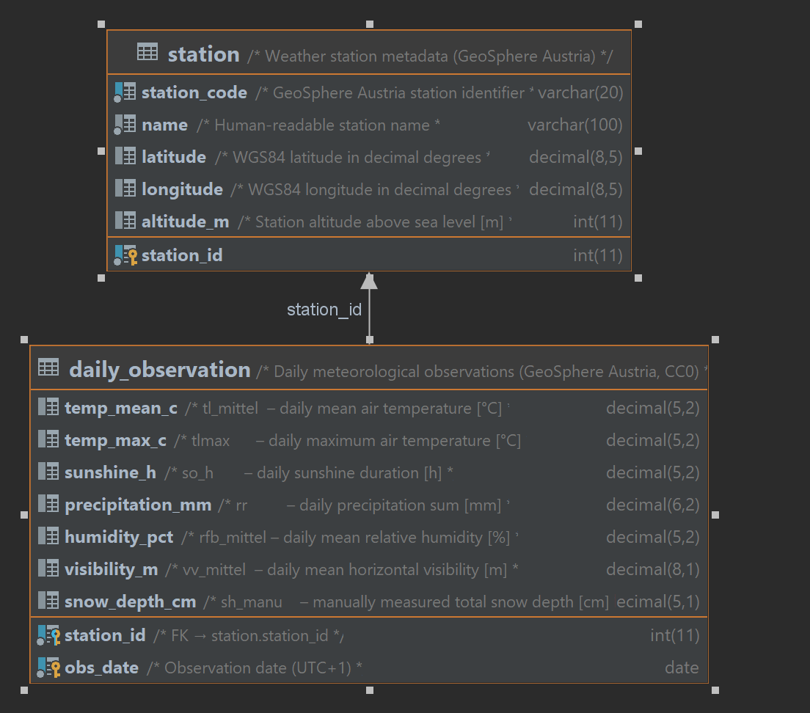

# Entity–Relationship Diagram

Schema: **Frost Day Prediction in Vienna**  
Source: GeoSphere Austria – Messstationen Tagesdaten v2  
Normal form: **3NF**

## Design decisions

| Decision | Rationale |
|---|---|
| Two-table split | Separates station-level facts (name, coordinates) from time-series measurements, avoiding repetition of station metadata in every row. |
| Composite PK `(station_id, obs_date)` | Each station contributes exactly one observation row per calendar day; the pair is a natural, minimal key. |
| Surrogate `station_id` | Decouples the internal PK from the GeoSphere station code, which is preserved as a unique alternate key (`station_code`). |
| No `is_frost_day` column | A frost-day flag (min temp < 0 °C) would be transitively dependent on `temp_min_c`, violating 3NF. The label is materialised via a VIEW at query time. |
| `visibility_m` for `vv_mittel` | GeoSphere Austria parameter `vv` denotes horizontal visibility in metres, not wind speed. |
